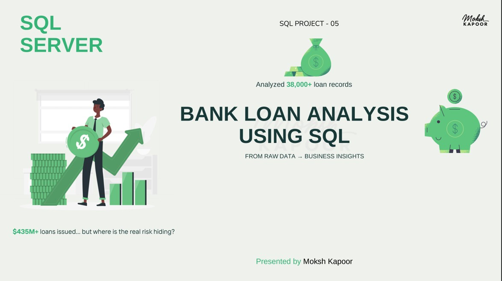

# 🏦 Bank Loan Portfolio Risk & Performance Analysis | SQL Project

An advanced **SQL analytics project** analyzing a real-world bank loan portfolio containing **38,000+ loan records** to evaluate borrower behavior, financial performance, loan demand trends, and credit risk.

This project focuses entirely on **SQL-driven analytics**, where all KPIs, metrics, and business insights were derived using advanced SQL queries.

---

# 📊 Project Preview

### 🎥 Workings of Bank Loan Portfolio Risk & Performance Analysis Project (SQL)

📌 Click on the image to see the working of this project as a presentation  

## 📺 SQL Analysis Preview

<a href="https://www.linkedin.com/posts/moksh-kapoor-618495322_bank-loan-analysis-sql-project-5-activity-7449312978828673025-j0sp?utm_source=share&utm_medium=member_desktop&rcm=ACoAAFGVzjQBQzKnpNzkuOZayyyvYW4FkHnrf28" target="_blank">
  
</a>

---

## 🧩 Data Model

<a href="https://www.linkedin.com/posts/moksh-kapoor-618495322_bank-loan-analysis-sql-project-5-activity-7449312978828673025-j0sp?utm_source=share&utm_medium=member_desktop&rcm=ACoAAFGVzjQBQzKnpNzkuOZayyyvYW4FkHnrf28" target="_blank">
  
</a>

---

# 📁 Dataset Overview

This project analyzes a **Bank Loan Portfolio dataset** representing real-world lending operations across borrower profiles, loan issuance, repayment behavior, and credit risk.

The dataset contains detailed information such as:

- Borrower demographics  
- Loan amount & installment  
- Interest rate & DTI ratio  
- Loan purpose  
- Loan status  
- Credit grades  
- Home ownership  
- Verification status  
- Employment length  
- Repayment history  

The dataset is structured around a single fact table:  
`financial_loan`

---

# 🎯 Business Problem & Analysis

Banks need data-driven insights to:

- Identify high-risk borrowers  
- Reduce loan defaults  
- Improve loan portfolio performance  
- Understand borrower behavior patterns  
- Monitor repayment performance  
- Track monthly loan growth trends  

This project analyzes the complete loan lifecycle — from application and funding to repayment and default tracking.

---

# 📊 Key Business Questions Solved

## 🏦 Portfolio Analysis
- Total loan applications  
- Total funded amount  
- Total amount repaid  
- Average loan amount  
- Fully Paid vs Charged Off loans  
- Active loan exposure  

## 📈 Trend Analysis
- Month-over-Month (MoM) loan growth  
- Monthly loan application trends  
- Interest rate trends over time  
- Monthly funded amount analysis  

## 👤 Borrower Segmentation
- Loan distribution by purpose  
- Home ownership analysis  
- Employment length analysis  
- Income segment analysis  
- Verification status trends  
- Top states by loan applications  

## ⚠️ Risk & Credit Analysis
- Default rate by loan grade  
- Bad loan percentage  
- High-risk loan segmentation  
- Default rate by loan term  
- State-wise default analysis  
- DTI vs default behavior  

---

# 🛠️ SQL Techniques & Concepts Used

## 🔹 Data Cleaning & Validation
- Data quality checks  
- Date standardization  
- Numeric conversion  
- Validation of loan categories  

## 🔹 SQL Concepts
- Aggregate Functions (`SUM`, `AVG`, `COUNT`)  
- Conditional Logic (`CASE WHEN`)  
- Common Table Expressions (CTEs)  
- Window Functions (`LAG`)  
- Ranking & Sorting (`TOP`, `ORDER BY`)  
- Date Functions (`MONTH`, `DATENAME`, `DATEDIFF`)  
- Pivoting & segmentation analysis  

---

# 📊 Core KPIs Calculated in SQL

| KPI Category | Metrics |
|---|---|
| Portfolio KPIs | Total Loans, Funded Amount, Repaid Amount |
| Trend KPIs | MoM Loan Growth, Monthly Trends |
| Borrower KPIs | Avg Income, DTI, Loan Purpose |
| Risk KPIs | Bad Loan %, Default Rate, High-Risk Loans |

---

# 📌 Key Insights & Findings

| Insight | Finding |
|---|---|
| Total Portfolio Value | $435M+ funded |
| Total Repayment | $470M+ repaid |
| Overall Default Rate | ~14% |
| High-Risk Segment | Grades E–G |
| Riskier Loan Term | 60-month loans |
| Most Common Loan Purpose | Debt Consolidation |
| Borrower Trend | Middle-income borrowers dominate |
| High Default Indicator | High DTI borrowers |

---

# 💡 Strategic Recommendations

- Tighten approval criteria for high DTI borrowers  
- Reduce exposure to long-term high-risk loans  
- Monitor lower credit grades more aggressively  
- Focus on regional risk segmentation  
- Improve verification processes for risky borrower groups  
- Optimize lending strategies based on repayment trends  

---

# 🔍 Key Learnings

Through this project, I improved my skills in:

- Advanced SQL Querying  
- Window Functions & CTEs  
- Financial & Risk Analytics  
- Data Cleaning & Validation  
- Trend & Segmentation Analysis  
- KPI Development  
- Business Intelligence & Reporting  

---

# 📂 Repository Structure

```bash
bank-loan-portfolio-sql/
│
├── Datasets/
│   ├── financial_loan.csv
|
├── Images/
│   ├── Bank.jpg
│   └── loan schema.jpg
│
├── SQL Queries.sql
├── README.md
```

---

# 👤 Author

## Moksh Kapoor  
📊 Aspiring Data Analyst  

### Skills
SQL • Power BI • Excel • Python

---

# 🔗 Connect With Me

<a href="https://www.linkedin.com/in/moksh-kapoor-618495322/" target="_blank">
  Visit My LinkedIn Profile
</a>

---

⭐ If you found this project useful, consider giving this repository a star!
